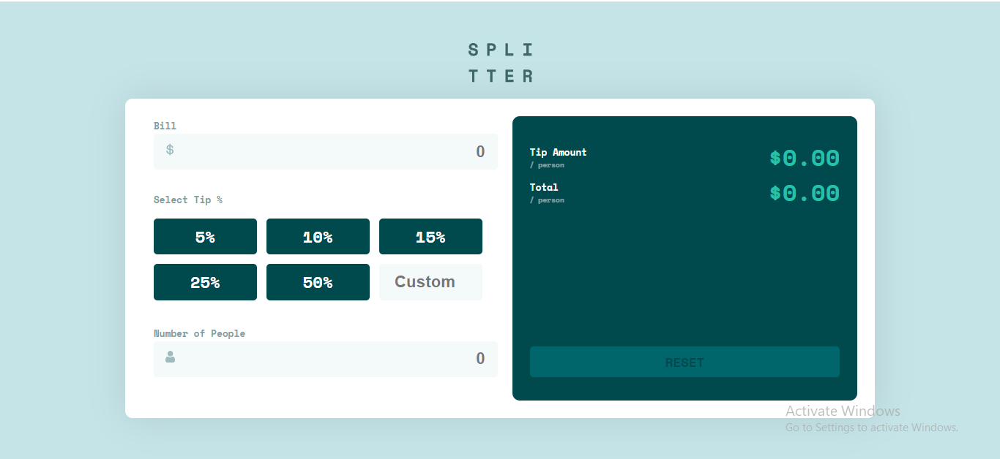
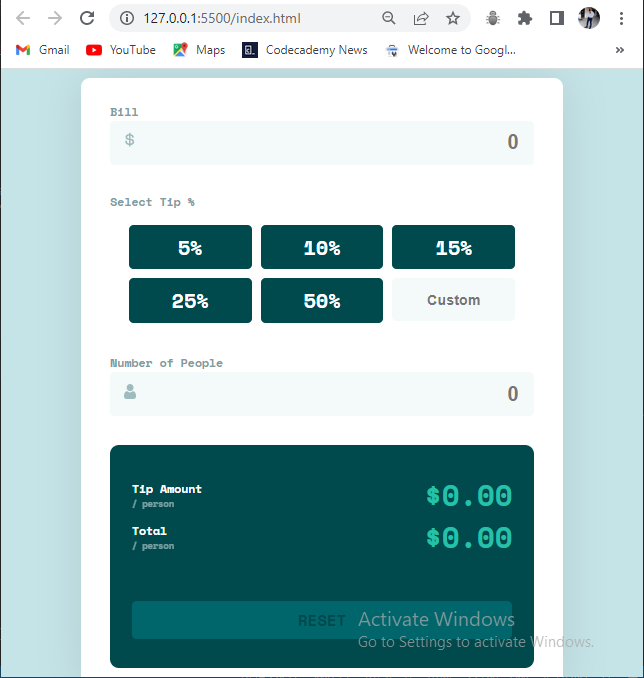

# Frontend Mentor - Tip calculator app solution

This is a solution to the [Tip calculator app challenge on Frontend Mentor](https://www.frontendmentor.io/challenges/tip-calculator-app-ugJNGbJUX).

## Table of contents

- [Overview](#overview)
  - [The challenge](#the-challenge)
  - [Screenshot](#screenshot)
  - [Links](#links)
  - [My process](#my-process)
  - [Built with](#built-with)
  - [What I learned](#what-i-learned)
  - [Continued development](#continued-development)
  - [Author](#author)
  - [Acknowledgments](#acknowledgments)

## Overview

### The challenge

Users should be able to:

- View the optimal layout for the app depending on their device's screen size
- See hover states for all interactive elements on the page
- Calculate the correct tip and total cost of the bill per person

### Screenshot




### Links

- Solution URL: [here](https://your-solution-url.com)
- Live Site URL: [Add live site URL here](https://your-live-site-url.com)

## My process
- Draft out how I want the layout to look
- Structure the project using semantic markups
- Link my CSS and apply my generic rules, import and apply font
- Set my CSS variable
- Start implementing project layout using flexbox
- Manipulate DOM to fetch form input values
- Still ongoing... 


### Built with

- Semantic HTML5 markup
- CSS custom properties
- Flexbox
- Mobile-first workflow
- Vanilla JS

### What I learned

```css
  .form-input input[type=number]::-webkit-inner-spin-button, 
  .form-input input[type=number]::-webkit-outer-spin-button{
      -webkit-appearance: none;
      margin: 0;
  }
```
```js
  bill.addEventListener("keyup", e => {
      billAmount = Number(e.target.value)
  })

  noOfPeople.addEventListener("keyup", e => {
      numOfPeople = Number(e.target.value)
  })

  Array.from(tipPercentages).forEach(tipPercentage => {
      tipPercentage.addEventListener("click", e => {
          if (e.target.innerText.include("%")){
              tipPercentage = Number(e.target.innerText.replace("%", ""))
          }
      })
  })
```

### Continued development

- -webkit appearance
- CSS variables
- Array Functions

## Author
- LinkedIn - [Oghenemeru Avwemoya](https://www.linkedin.com/in/oghenemeruavwemoya)
- Frontend Mentor - [@skiboss](https://www.frontendmentor.io/profile/skiboss)
- Twitter - [@meruAvwemoya](https://www.twitter.com/meruAvwemoya)

## Acknowledgments

[@devdre1909](https://www.github.com/devdre1909)
[Future Academy Africa] (https://futureacademy.africa)